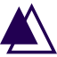

## 👋🏾 Hi there ! I am Mohamed Sadjad OUSMANE, another developer from Cotonou, Benin 🇧🇯

---

### About me 👨🏽‍💻

- 🎓 I’m a Computer Science graduate
- 💼 I'm currently working at [OPEN SI](https://www.opensi.co "https://www.opensi.co")
- 📫 How to reach me: [e-mail](mailto:ousmanesadjad@gmail.com "ousmanesadjad@gmail.com") or [call](tel:+22966303593 "+22966303593") me
- 💬 Ask me about frontend and backend development for Web
- 👯 I’m looking to collaborate with any tech enthousiast ❤️
- 🌱 I’m currently learning Go and Flutter 🐍
- ⚡ Fun fact: I am almost, always working 😄

## 🛠 Techs

        

<!---
sadjous/sadjous is a ✨ special ✨ repository because its `README.md` (this file) appears on your GitHub profile.
You can click the Preview link to take a look at your changes.
--->
